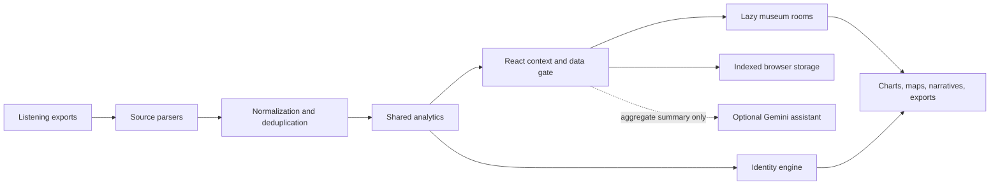

<div align="center">


<br>

[](https://lirioth.github.io/NovaMusicLab/)
[](https://react.dev/)
[](https://www.typescriptlang.org/)
[](https://vite.dev/)
[](#-privacy-architecture)
[](https://lirioth.github.io/NovaMusicLab/)

### Turn years of listening history into an interactive personal music museum

**Multi-source imports · honest analytics · emotional maps · cultural DNA · artist identity · shareable reports**

</div>

---

## 🧭 Explore this README

[Vision](#-the-vision) ·
[Sources](#-supported-listening-archives) ·
[Museum rooms](#-museum-rooms) ·
[Privacy](#-privacy-architecture) ·
[Architecture](#-application-architecture) ·
[Quality](#-quality-gates) ·
[Setup](#-local-development) ·
[Deployment](#-deployment) ·
[Roadmap](#-roadmap)

---

## 🌌 The vision

**Nova Music Lab** is a local-first music analytics museum.

Instead of reducing a listening archive to a few charts, the application turns it into a guided digital exhibition: historical eras, records, obsessions, emotional patterns, geography, platforms, achievements, generative visual identity, and a final narrative report.

The project is designed around four principles:

1. **Personal:** every insight is derived from the archive currently loaded.
2. **Private:** raw files are parsed in the browser and remain on the device.
3. **Source-aware:** Last.fm, Spotify, Apple Music, ListenBrainz, and YouTube provide different fields; the UI labels those differences honestly.
4. **Data-honest:** unknown information remains unknown instead of being filled with fabricated certainty.

> Nova Music Lab is not a streaming service and does not need a backend database. It is a static React application that transforms user-selected exports into an explorable museum.

---

## 📊 Repository snapshot

| Metric | Current local value |
|---|---:|
| Branch | `main` |
| Revision | `6732b65` |
| Commit count | 61 |
| Tracked files | 249 |
| React component modules detected | 60 |
| GitHub workflow files detected | 2 |
| Source size excluding `.git`, `node_modules`, and `dist` | 7.24 MB |
| Last commit date | 2026-07-14 |
| Last commit | S |
| Origin | `https://github.com/LiriothTeltanion/NovaMusicLab.git` |
| Remote `main` revision | `6732b65` |
| Local sync position | ahead 0 · behind 0 |
| README generated | 2026-07-14 |

**Most common tracked extensions:** `.tsx` 106 · `.ts` 61 · `.mjs` 31 · `.json` 24 · `.png` 7 · `.md` 4 · `.css` 4 · `.js` 3 · `.yml` 2

---

## 🛰️ Supported listening archives


| Source | Supported export | Typical strengths |
|---|---|---|
| **Last.fm** | CSV with artist, album, track, and timestamp | Long-term scrobble history, sessions, streaks, and chronology |
| **Spotify** | Extended Streaming History JSON | Listening duration, platform, country, skip behavior, and short plays |
| **Apple Music** | `Play Activity.csv` | Apple listening activity and playback history |
| **ListenBrainz** | Listen JSON export | Open listening-history records and timestamps |
| **YouTube / YouTube Music** | Google Takeout JSON or HTML watch history | Music-video and YouTube Music activity |
| **Combined museum** | Any supported combination | Normalization, source labels, overlap handling, and cross-source deduplication |

Uploads can be mixed. Nova Music Lab rebuilds the analytics from the selected archive rather than forcing every visitor into the bundled demonstration dataset.

---

## 🏛️ Museum journey


```text
Private export files
        ↓
Source-specific parsers
        ↓
Normalized listening events
        ↓
Cross-source deduplication
        ↓
Shared analytics engine
        ↓
Interactive museum rooms
        ↓
Narrative report and shareable artifacts
```

Listening platforms expose different fields. A Last.fm-only archive cannot produce Spotify device or skip metrics; a Spotify-only archive cannot reconstruct Last.fm scrobbles. Missing data is presented as a source limitation, never as invented data.

---

## 🖼️ Museum rooms

| Room or system | Purpose |
|---|---|
| **Achievements** | Milestones and record-style achievements. |
| **AIAssistant** | Optional Gemini conversation over aggregate insights. |
| **ArtistIdentity** | Generative alias, sound, visual identity, and cover art. |
| **CulturalMap** | Artist origins and listening geography. |
| **Dashboard** | High-level listening metrics and archive overview. |
| **DataQualityCenter** | Coverage, missing fields, and source limitations. |
| **DataUploader** | Multi-source import and local parsing interface. |
| **EmotionalMap** | Mood-driven interpretation and listening stations. |
| **EraExplorer** | Yearly eras and changes in listening identity. |
| **FinalReport** | Long-form narrative summary and closing report. |
| **HiddenInsights** | Less obvious patterns across the archive. |
| **InnerWorld** | Narrative interpretation of patterns and tendencies. |
| **MuseumComparator** | Compare museum states or archive snapshots. |
| **ObsessionDetector** | Repeated tracks, streaks, and focused listening periods. |
| **PersonalityRadar** | Data-derived musical personality signals. |
| **PlatformsDevices** | Platforms, devices, countries, skips, and short plays. |
| **RecentPulse** | Recent listening activity. |
| **SpotifyVsLastfm** | Cross-source comparison and overlap analysis. |
| **StatsDeepDive** | Detailed metrics beyond the main dashboard. |
| **TimeCapsule** | Historical archive exploration through time. |
| **TopHistorico** | Historical leaders across artists, tracks, and albums. |
| **WrappedCard** | Shareable recap card. |

The application lazy-loads museum rooms so the shell can appear before heavy charts, offline knowledge, and rarely opened sections are downloaded.

---

## 🔒 Privacy architecture


### Local processing

- Raw imports are parsed in the browser.
- The static application has no backend database for listening archives.
- Raw Spotify fields that are not required for analytics, such as IP addresses, are not retained.
- Stored browser data remains tied to the current browser profile and device.

### Optional Gemini assistant

The AI assistant remains disabled until the visitor provides a personal Gemini API key.

When enabled:

- The browser sends the question and an aggregate listening summary.
- Raw export files are not sent.
- The key is stored in browser `localStorage`.
- It should only be enabled in a trusted browser profile.
- Requests are governed by Google's API and privacy policies.

---

## 🧠 Data-honesty contract

- Unknown genres remain unclassified until curated or resolved.
- Source-specific gaps are labeled.
- Artist identity is derived from the loaded archive.
- Generative cover art is deterministic and based on real signals.
- Cross-source overlap is normalized before totals are shown.
- Curated media links are audited instead of accepted from name matching alone.
- Data-quality checks can fail the build when strict expectations are violated.

---

## 🧩 Application architecture



### Key modules

| Module | Responsibility |
|---|---|
| `src/utils/parser.ts` | Parse exports and create one normalized dataset |
| `src/utils/analytics.ts` | Shared calculations used by rooms and reports |
| `src/utils/identityEngine.ts` | Build data-derived personality, alias, sound, and visual identity |
| `src/utils/datasetStorage.ts` | Browser-side dataset persistence |
| `src/utils/deepLinks.ts` | Shareable navigation and museum deep links |
| `src/utils/i18n.ts` | Language, locale, and text direction |
| `src/context/AppContext.tsx` | Shared language, theme, and UI state |
| `src/App.tsx` | Museum shell, routing, lazy rooms, and transitions |
| `src/data/music_dna_compiled.json` | Bundled demonstration dataset |

---

## ⚙️ Technology stack

| Layer | Technology |
|---|---|
| UI | React ^19.2.7 + TypeScript ~6.0.2 |
| Build | Vite ^8.1.1 |
| Styling | Tailwind CSS |
| Animation | Framer Motion + Canvas Confetti + animated SVG |
| Visualization | Recharts and custom canvas/SVG systems |
| Icons | Lucide React |
| Testing | Vitest ^4.1.9 + Testing Library + jsdom |
| Linting | Oxlint |
| Hosting | GitHub Pages |
| Runtime model | Fully static and local-first |

**Node requirement:** `>=22.12.0`

---

## 🎨 Themes, motion, and multilingual experience


Nova Music Lab treats presentation as part of the analysis rather than a decorative afterthought.

- Fourteen selectable themes span dark and light museum atmospheres.
- Framer Motion drives room transitions, tactile controls, and staged reveals.
- Custom canvas and SVG systems generate mood-responsive visual art.
- English and Spanish are available in the interface.
- Hebrew-generation tooling supports right-to-left interface resources.
- Motion-sensitive visitors can rely on reduced-motion behavior where the application exposes it.

The README animations are repository-hosted SVG files. They do not execute JavaScript and do not contact an external animation service.

---

## ⚡ Performance design

- Museum rooms are loaded with `React.lazy`.
- Heavy charts and motion libraries are split into stable vendor chunks.
- The bundled demonstration dataset loads asynchronously.
- Offline artist knowledge stays outside the entry bundle until needed.
- A bundle-budget script checks the production output.
- Pages deployment refuses to upload an artifact when verification fails.

---

## ✅ Quality gates


```bash
npm run verify
```

The complete check runs:

```text
lint
→ strict data audit
→ strict media-link audit
→ tests
→ production build
→ bundle-budget verification
```

### Available commands

| Command | Purpose |
|---|---|
| `npm run dev` | Start the Vite development server. |
| `npm run build` | Type-check and create the production bundle. |
| `npm run build:check` | Build and enforce the bundle budget. |
| `npm run verify` | Run lint, strict data audit, media-link audit, tests, and build checks. |
| `npm run lint` | Run Oxlint. |
| `npm run compile:data` | Compile an explicitly selected local listening archive. |
| `npm run audit:data` | Inspect data quality and coverage. |
| `npm run audit:data:strict` | Fail when strict data-quality rules are violated. |
| `npm run audit:links` | Validate curated media links in strict mode. |
| `npm run knowledge:artists` | Build the offline artist-knowledge cache. |
| `npm run i18n:hebrew` | Generate Hebrew UI resources. |
| `npm run i18n:hebrew:central` | Generate central Hebrew resources. |
| `npm run i18n:hebrew:data` | Generate Hebrew JSON resources. |
| `npm run icons:generate` | Generate the Nova icon collection. |
| `npm run test` | Run Vitest. |
| `npm run preview` | Serve the production build locally. |

### Recommended pre-push workflow

```bash
npm ci
npm run verify
git status
```

---

## 💻 Local development

```bash
git clone https://github.com/LiriothTeltanion/NovaMusicLab.git
cd NovaMusicLab
npm ci
npm run dev
```

### Production verification

```bash
npm run verify
npm run preview
```

### Compile an explicitly selected personal archive

```bash
npm run compile:data -- --source-dir "/path/to/your/exports"
```

The compiler requires an explicit source folder and does not search personal directories automatically. Use `--output <path>` to create a review copy before replacing the bundled dataset.

---

## 🚀 Deployment

`.github/workflows/deploy.yml` runs on pushes to `main`:

1. Checkout
2. Node from `.nvmrc`
3. `npm ci`
4. `npm run verify`
5. Upload `dist`
6. Deploy GitHub Pages

Vite uses a relative base so the static bundle works from a project-site subdirectory.

**Live museum:** [lirioth.github.io/NovaMusicLab](https://lirioth.github.io/NovaMusicLab/)

---

## 📁 Project structure

```text
NovaMusicLab/
├─ .github/workflows/deploy.yml
├─ public/
├─ scripts/
├─ src/
│  ├─ components/
│  ├─ context/
│  ├─ data/
│  ├─ utils/
│  ├─ App.tsx
│  └─ types.ts
├─ assets/readme/
│  ├─ nova-music-lab-banner.svg
│  ├─ source-constellation.svg
│  ├─ museum-journey.svg
│  ├─ privacy-pulse.svg
│  ├─ quality-gates.svg
│  └─ theme-spectrum.svg
├─ package.json
├─ vite.config.ts
├─ vitest.config.ts
└─ README.md
```

---

## 🧪 Engineering case study

Nova Music Lab is useful as a portfolio project because it combines multiple difficult concerns in one static application:

| Challenge | Engineering response |
|---|---|
| Different export formats | Source-specific parsers feeding one normalized model |
| Duplicate plays across services | Timestamp and normalized artist/track overlap logic |
| Missing source fields | Source-aware gaps instead of fabricated values |
| Heavy museum interface | Lazy rooms, vendor chunks, and asynchronous data loading |
| Curated artist/media knowledge | Offline enrichment plus strict link audits |
| Personal AI interaction | Optional aggregate-only Gemini boundary |
| Reliable static deployment | One verification command before GitHub Pages upload |
| Multilingual UI | Central language utilities and generated Hebrew resources |

This makes the repository more than a dashboard: it is a privacy-conscious data product, visualization system, importer suite, and creative museum interface.

---

## 🗺️ Roadmap

### Documentation and presentation

- [x] Explain every supported data source
- [x] Document local-first privacy and the optional AI boundary
- [x] Document the quality and deployment pipelines
- [ ] Add real desktop, tablet, and mobile screenshots
- [ ] Add a short museum walkthrough video or GIF
- [ ] Add a public sample export for importer testing

### Product and engineering

- [ ] Expand accessibility audits and keyboard-only navigation
- [ ] Add exportable museum-state and report packages
- [ ] Continue reducing initial and chart-room bundle costs
- [ ] Expand importer fixtures for locale and format variants
- [ ] Add clearer coverage indicators to inference-heavy rooms
- [ ] Publish architecture decisions and performance measurements

---

## 🌍 Multilingual summary

<details>
<summary><strong>🇻🇪 Español</strong></summary>

Nova Music Lab convierte historiales de Last.fm, Spotify, Apple Music, ListenBrainz y YouTube en un museo musical interactivo. Los archivos se procesan localmente en el navegador y pueden combinarse de manera consciente de su fuente.

La aplicación presenta estadísticas, épocas, récords, obsesiones, mapas emocionales y culturales, identidad artística generativa y un informe narrativo final. Cuando una fuente no contiene un tipo de información, la interfaz lo indica con honestidad en lugar de inventarlo.

</details>

<details>
<summary><strong>🇮🇱 עברית</strong></summary>

Nova Music Lab הופך היסטוריית האזנה מ-Last.fm, Spotify, Apple Music, ListenBrainz ו-YouTube למוזיאון מוזיקלי אינטראקטיבי.

הקבצים מעובדים באופן מקומי בדפדפן. האפליקציה מציגה סטטיסטיקות, תקופות, שיאים, דפוסי האזנה, מפות רגשיות ותרבותיות, זהות אמן שנוצרת מהנתונים ודוח מסכם. כאשר מקור מסוים אינו כולל מידע מסוים, המערכת מסמנת את החוסר במקום להמציא נתונים.

</details>

---

## 👨‍💻 Creator

**Kevin Cusnir** — [`LiriothTeltanion`](https://github.com/LiriothTeltanion)

Nova Music Lab combines frontend engineering, data visualization, music technology, privacy-conscious personal analytics, AI-assisted development, and generative art.

---

<div align="center">

### Your archive is not just a list of plays. It is a map of who you were, what you felt, and how your sound evolved.

**README edition 4.0 · Generated 2026-07-14**

</div>
