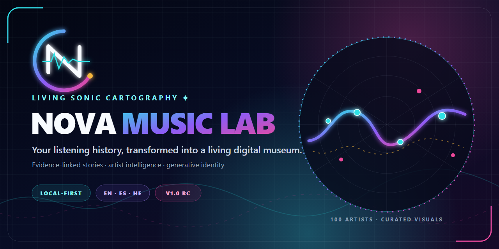
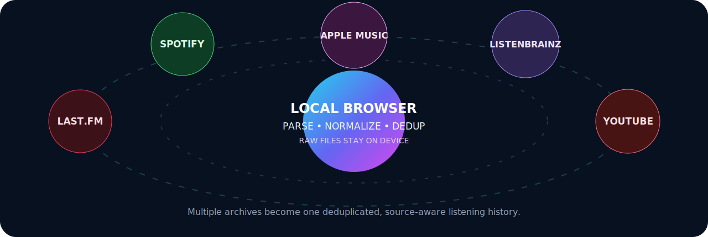
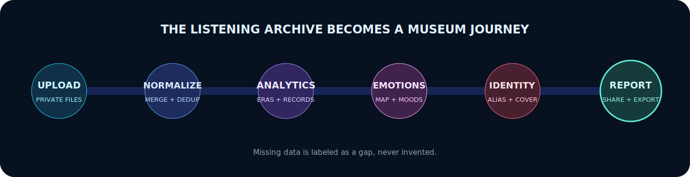
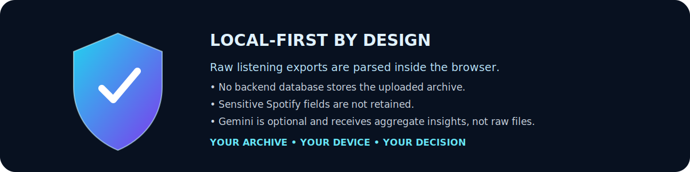
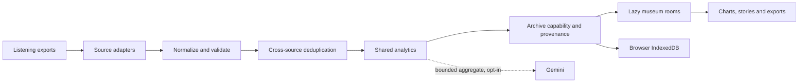
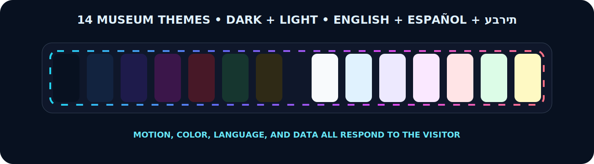
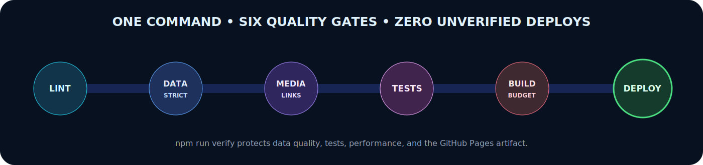

<div align="center">



<br>

[](https://github.com/LiriothTeltanion/NovaMusicLab/actions/workflows/quality-and-pages.yml)
[](https://liriothteltanion.github.io/NovaMusicLab/)
[](#-privacy-and-network-boundary)
[](#-language-themes-and-accessibility)

### Your listening history, transformed into a living personal museum 🎧

Import a Spotify, Last.fm, Apple Music, ListenBrainz or YouTube archive. Nova Music Lab processes raw files in the browser and turns evidence into timelines, obsessions, emotional maps, cultural journeys, generative identity and shareable reports.

**Current code version:** `1.0.0-rc.1`, the release-candidate foundation for **Nova Music Lab v1.0 — The Evidence-First Museum**. No version tag or GitHub Release exists until that exact commit completes release acceptance. IndexedDB **schema v4** is a storage contract, not the product's major version.

[Explore the live flagship](https://liriothteltanion.github.io/NovaMusicLab/) ·
[Read the architecture](./docs/architecture/OVERVIEW.md) ·
[Follow the v1 roadmap](./ROADMAP.md)

</div>

---

## 🌌 Why Nova Music Lab exists

Streaming platforms usually reduce years of listening to a short recap. Nova Music Lab treats an archive as a personal cultural artifact: something to investigate, revisit and interpret without surrendering the raw history to another analytics backend.

The project is built around four commitments:

1. **Evidence before spectacle.** Unknown information remains unknown; estimates and interpretations must be distinguishable from observed facts.
2. **Local-first ownership.** Visitor-selected archives are parsed and stored in the browser.
3. **Source awareness.** Each provider exposes different fields, so rooms only claim capabilities their active archive can support.
4. **A museum, not a spreadsheet.** Motion, sound-inspired art, narrative and exploration make the evidence emotionally legible.

---

## 🪞 Two museum modes

| Mode | Purpose | Data boundary |
|---|---|---|
| **Flagship Exhibition** | A curated demonstration of Kevin's personal music museum and Nova's full visual language. | A reviewed aggregate dataset is intentionally published with the static site and governed by [`public_dataset_manifest.json`](./src/data/public_dataset_manifest.json). |
| **My Museum** | A visitor imports supported exports and rebuilds the quantitative museum from the active archive. | Raw files stay in the browser; the app does not upload them to a Nova Music Lab server. |

The v1 milestone is formalizing this boundary everywhere: flagship-only stories must never masquerade as visitor-derived analysis, and every interpretive room must disclose its evidence level.

---

## 🛰️ Supported listening archives



| Source | Supported export | Strongest evidence |
|---|---|---|
| **Last.fm** | CSV export | Long chronology, scrobbles, sessions and streaks |
| **Spotify** | Extended Streaming History JSON | Duration, platforms, country, skips and short plays |
| **Apple Music** | `Play Activity.csv` | Apple listening activity and playback history |
| **ListenBrainz** | Listen JSON export | Open timestamped listening records |
| **YouTube / YouTube Music** | Google Takeout JSON or HTML history | Music video and YouTube Music activity |
| **Combined museum** | Any supported combination | Source labels, normalization and evidence-aware overlap handling |

Imports can be mixed. Source-specific fields remain source-specific: for example, Last.fm alone cannot prove Spotify device or skip behavior.

---

## 🏛️ The museum journey



Nova Music Lab is being organized into three paths:

- **Quick Tour** — Overview → Eras → Historical Top → Personality → Emotions → Final Report.
- **Full Museum** — every narrative, cultural, identity and archive room.
- **Lab Tools** — Import, Compare, Platforms, Data Quality, Stats, Genre Studio and exports.

Representative rooms include:

| Experience | What it explores |
|---|---|
| **Dashboard** | Archive identity, coverage and high-level signals |
| **Era Explorer** | How listening identity changes across years |
| **Top Histórico** | Artist, track and album dossiers with evidence-linked context |
| **Obsession Detector** | Repetition, streaks and concentrated listening periods |
| **Emotional Map** | Interpretive mood stations grounded in available signals |
| **Cultural Map** | Artist origins and listening geography |
| **Artist Identity** | Deterministic generative visual and sonic identity |
| **Data Quality Center** | Coverage, limitations and enrichment priorities |
| **Final Report** | A guided closing narrative and exportable summary |

Heavy rooms and data catalogs are lazy-loaded so the museum shell can appear before rarely visited analysis code is downloaded.

---

## 🔒 Privacy and network boundary



### What stays local

- Visitor-selected raw exports are parsed in the browser.
- Imported museum state is stored in browser IndexedDB, not in a Nova backend database.
- Raw Spotify fields that are not required for analysis, such as IP addresses, are not retained.
- Clearing browser storage removes the local visitor museum from that browser profile.

### What is public

- The GitHub repository and Pages site contain a reviewed flagship aggregate dataset.
- Exact-granularity flagship sections require an explicit declaration in the public dataset manifest.
- CI audits the bundle for undeclared sections and raw identity/network fields.

### Optional and external requests

| Request | When it happens | What leaves the device |
|---|---|---|
| Google Fonts | Initial document load | Normal font request metadata |
| Remote artwork | A room displays curated external media | Image request metadata |
| YouTube/Spotify media | A visitor opens an embed or verified external link | The provider receives the request |
| Gemini | Only after a visitor explicitly configures a personal key and sends a question | The question and a bounded aggregate summary; never the raw export file |

Nova Music Lab is therefore **local-first**, not network-isolated. A stricter no-remote-media Privacy Mode is tracked in the [roadmap](./ROADMAP.md).

Read the full [privacy threat model](./docs/architecture/PRIVACY_THREAT_MODEL.md) and [public data policy](./docs/data/PUBLIC_DATA_POLICY.md).

---

## 🧠 Evidence contract

Every analytical or narrative output should be classified as one of:

- **Observed** — directly supported by normalized archive events.
- **Derived** — deterministically calculated from observed data.
- **Inferred** — an interpretation with visible evidence and limitations.
- **Unavailable** — the active source cannot support the claim.

The project deliberately rejects plausible-looking fabricated numbers. Data reconciliation, source coverage, media identities and public-bundle privacy are enforced through scripts and tests.

## 🎨 Artist knowledge and Living Sonic Cartography

The generated artist manifest currently contains **100 artist records** and **295 provenance-aware visual assets**. Artist aliases, MusicBrainz/Wikidata identifiers, countries, genres, releases, members and official links remain separate from private play counts. Each image record carries its source, license-review state, attribution, focal point and cache/privacy policy; **171 legacy assets remain visibly queued for license review** rather than being mislabeled as reusable.

The manifest installs into the local Dexie database only when its source fingerprint changes. Returning visitors download the small metadata fingerprint during idle bootstrap, not the complete artist catalog on every visit.

The interface uses a shared **Living Sonic Cartography** registry for room palettes, atmospheric geometry and semantic navigation icons. The Nova orbit/waveform mark now drives crisp favicon, PWA, maskable and monochrome icon variants as well as the repository's static social preview.

---

## 🧩 Architecture



| Layer | Primary responsibility |
|---|---|
| `src/utils/parser.ts` | Source parsing, normalization and merged dataset construction |
| `src/utils/analytics.ts` | Shared quantitative calculations |
| `src/utils/datasetStorage.ts` | Local browser persistence and portable dataset validation |
| `src/db/` | Dexie/IndexedDB schema v4, typed storage outcomes, atomic museum activation and compatibility stores |
| `src/knowledge/` | Validated artist-knowledge manifest and provenance-rich visual records |
| `src/components/museumVisualIdentity.ts` | Shared room families, palettes, motion atmospheres and icon identity |
| `src/utils/identityEngine.ts` | Deterministic generative identity |
| `src/context/AppContext.tsx` | Language, theme and navigation state |
| `src/App.tsx` | Museum shell, routing, transitions and data gate |
| `src/data/` | Curated public enrichment and the reviewed flagship bundle |

Database design, migrations and failure states are documented in [Storage and migrations](./docs/architecture/STORAGE_AND_MIGRATIONS.md).

---

## 🌍 Language, themes and accessibility



- English, Spanish and Hebrew interfaces.
- Correct Hebrew RTL document direction and `he-IL` formatting.
- Fourteen dark and light museum themes.
- Keyboard-aware navigation, focus restoration and mobile drawer behavior.
- Expressive, Calm and Static atmosphere modes; Calm is the default and the operating-system reduced-motion preference overrides animation.
- Reduced-motion behavior across application transitions, charts, canvas art and static repository artwork.
- Exact-value chart tables and CSV exports for non-visual access.

The v1 accessibility pass expands automated contrast, axe, browser-matrix and visual-regression coverage. See [Accessibility](./docs/design/ACCESSIBILITY.md).

---

## ✅ Quality gates



```bash
npm run verify
node scripts/audit_public_bundle_privacy.mjs
```

The verified Pages pipeline runs:

```text
lint
→ strict data audit
→ strict media-link audit
→ artist-knowledge manifest audit
→ public-bundle privacy audit
→ PWA/installability contract audit
→ tests
→ TypeScript + production build
→ bundle budgets
→ Pages artifact
→ exact commit/version deployment smoke test
```

GitHub also runs CodeQL and dependency review. The Pages job can only deploy the artifact produced by the successful verification job.

---

## 💻 Local development

Requirements: Git and the Node version declared in `.nvmrc`.

```bash
git clone https://github.com/LiriothTeltanion/NovaMusicLab.git
cd NovaMusicLab
npm ci
npm run dev
```

Before opening a pull request:

```bash
npm run verify
node scripts/audit_public_bundle_privacy.mjs
git diff --check
git status
```

Useful commands:

| Command | Purpose |
|---|---|
| `npm run dev` | Start the local Vite server |
| `npm run build:check` | Build and enforce bundle budgets |
| `npm run verify` | Run the canonical code/data/test/build gate |
| `npm run audit:data` | Print current data coverage and priority queues |
| `npm run audit:links` | Validate curated media profiles and embeds |
| `npm run compile:data -- --source-dir <path> [--lastfm-file <csv>]` | Compile an explicitly selected local archive; ambiguous CSVs require an explicit path |
| `npm run preview` | Preview the production bundle locally |

The compiler never searches personal directories automatically. Use a review output and run the public-data audit before replacing any bundled flagship data.

---

## 📚 Documentation

| Guide | Purpose |
|---|---|
| [Architecture overview](./docs/architecture/OVERVIEW.md) | System boundaries and data flow |
| [Storage and migrations](./docs/architecture/STORAGE_AND_MIGRATIONS.md) | IndexedDB, dataset envelopes and recovery |
| [Privacy threat model](./docs/architecture/PRIVACY_THREAT_MODEL.md) | Assets, imports, network and public-data risks |
| [Data sources](./docs/product/DATA_SOURCES.md) | Source capabilities and honest limitations |
| [Public data policy](./docs/data/PUBLIC_DATA_POLICY.md) | Rules for the published flagship bundle |
| [Artwork schema](./docs/data/ARTWORK_SCHEMA.md) | Artist, album, track and gallery asset contracts |
| [Visual system](./docs/design/VISUAL_SYSTEM.md) | Living Sonic Cartography, icons and motion tiers |
| [Quality gates](./docs/operations/QUALITY_GATES.md) | Local and CI verification |
| [Release guide](./docs/operations/RELEASE.md) | Release candidate, tag, Pages and rollback process |
| [Contributing](./CONTRIBUTING.md) | Branch, commit, privacy and review expectations |
| [Security](./SECURITY.md) | Private vulnerability reporting |
| [Roadmap](./ROADMAP.md) | Ordered v1 and post-v1 priorities |
| [Changelog](./CHANGELOG.md) | Durable release history |

---

## 🚀 Deployment and releases

The production museum is deployed through GitHub Pages from the verified `main` artifact:

**https://liriothteltanion.github.io/NovaMusicLab/**

`main` is intended to remain deployable. Product work should use focused branches and pull requests; the release process is documented in [`docs/operations/RELEASE.md`](./docs/operations/RELEASE.md).

No formal GitHub release has been published yet. The package and working tree identify this candidate as `1.0.0-rc.1`; publishing that RC still requires a verified `main` deployment and release tag. Stable `v1.0.0` follows only after privacy, import/storage, accessibility, browser and live Pages acceptance checks pass.

---

## 👨‍💻 Creator

**Kevin Cusnir** — [LiriothTeltanion on GitHub](https://github.com/LiriothTeltanion)

Nova Music Lab combines frontend engineering, data visualization, music technology, privacy-conscious personal analytics, multilingual interaction, accessibility and generative art.

Third-party software, services, fonts and media remain subject to their own terms; see [`THIRD_PARTY_NOTICES.md`](./THIRD_PARTY_NOTICES.md). A repository-wide open-source license has not yet been selected.

<div align="center">

### Your archive is not just a list of plays. It is a map of who you were, what you felt and how your sound evolved. ✨

</div>
