<div align="center">

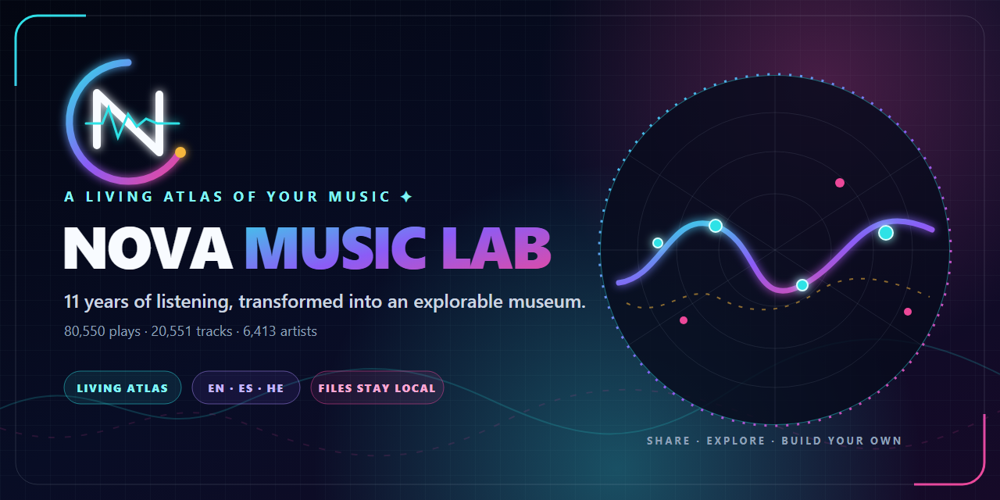

<br>

[](https://github.com/LiriothTeltanion/NovaMusicLab/actions/workflows/quality-and-pages.yml)
[](https://github.com/LiriothTeltanion/NovaMusicLab/releases/latest)
[](https://liriothteltanion.github.io/NovaMusicLab/)
[](#-privacy-and-network-boundary)
[](#-language-themes-and-accessibility)

### Your listening history, transformed into a living personal museum 🎧

Import a Spotify, Last.fm, Apple Music, ListenBrainz or YouTube archive, and optionally attach a private MusicBee library snapshot. Nova Music Lab processes selected files in the browser and turns evidence into timelines, obsessions, emotional maps, cultural journeys, generative identity and shareable reports.

**Current public version:** `1.5.0` — **deployed 2026-08-01**. **The Living Archive Gets a Face** removes invalid artist-image placeholders, clarifies genre and snapshot provenance, bounds archive imports and polishes mobile, keyboard and Hebrew RTL journeys.

**Current source candidate:** `1.6.0` — **private candidate 2026-08-09**. **The Living Archive Finds Its Voice** refreshes the complete archive through 2026-08-06, turns source evidence into clearer artist stories and keeps mobile navigation and public facts synchronized. It is not yet tagged, released or deployed.

**Verified public engineering evidence:** React 19 · TypeScript · Vite · Dexie/IndexedDB · Web Workers · 710 passing Vitest tests with 1 intentional private-fixture skip · 18/18 Playwright journeys · EN/ES/HE RTL · protected GitHub Pages CI. These figures describe the accepted v1.5.0 gate; v1.6.0 must pass its own frozen-source gate before publication. IndexedDB **schema revision 4** is a storage contract, not the product version.

**v1.6.0 local candidate evidence (2026-08-09):** Node 22.13.0 · 770 passing Vitest tests with 1 intentional private-fixture skip · 18/18 Playwright journeys in one worker · zero known npm vulnerabilities · strict data, privacy, accessibility and bundle gates passed. Final release media, pull-request CI and live Pages verification remain separate gates.

[Explore the live flagship](https://liriothteltanion.github.io/NovaMusicLab/) ·
[Read the architecture](./docs/architecture/OVERVIEW.md) ·
[Follow the product roadmap](./ROADMAP.md)

</div>

---

## ⚡ Try it in 30 seconds

1. Open the [live flagship](https://liriothteltanion.github.io/NovaMusicLab/) and enter the museum.
2. Start in **Explore**, the visual default; switch to **Guided** whenever you want plain-language context.
3. Open **Atlas** to explore artists, media and archive evidence.
4. Switch to **Deep Dive** when you want methodology and provenance.
5. In `1.2.0` — deployed **2026-07-29** — **Share & Feedback** prepares a WhatsApp invitation and **Audio Lab** previews a permitted local audio file without uploading it.
6. In `1.4.0` — deployed **2026-07-29** — a guest can add an optional local museum name, import compatible files and compare the resulting private museum directly with Kevin's public exhibition.
7. In `1.5.0` — deployed **2026-08-01** — portrait fallbacks, genre evidence, snapshot dates and bounded local imports become easier to trust.
8. In the `1.6.0` private candidate — dated **2026-08-09** — the archive grows through August 6 and its artist stories, mobile dock and public facts become clearer. This step is visible in source only until the release gate passes.

No account is required for the public exhibition or local archive import.

---

## 🖼️ v1.6.0 candidate visual evidence

These captures document the frozen source prepared for `1.6.0` — **private
candidate 2026-08-09**. They are generated and source-fingerprinted before
promotion; they do not claim a deployment. The live
[`build-meta.json`](https://liriothteltanion.github.io/NovaMusicLab/build-meta.json)
remains the authoritative deployment identity, so public v1.5.0 stays current
until the complete promotion gate passes.

<table>
  <tr>
    <td width="50%">
      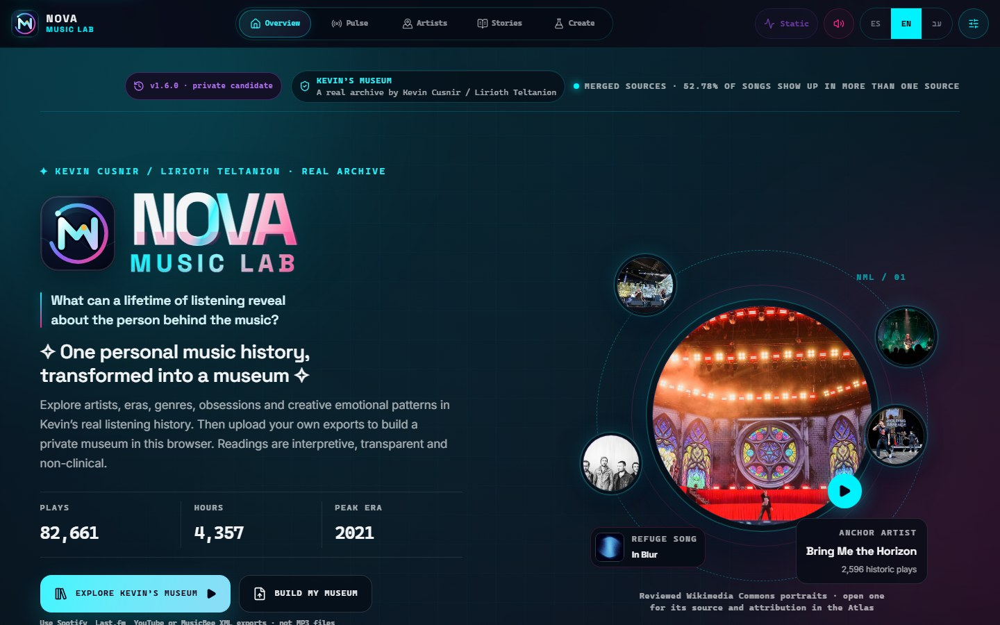
      <br><strong>One stronger identity</strong> — the refined wordmark, release story and living portraits invite exploration without duplicating the title.
    </td>
    <td width="50%">
      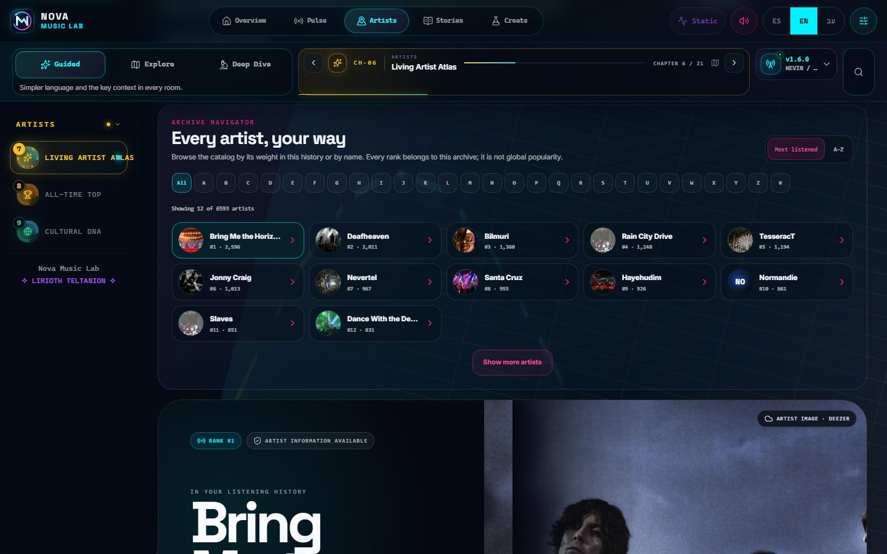
      <br><strong>The archive finds its voice</strong> — sourced artist stories, reviewed portraits, deterministic fallbacks and listening evidence share one navigable room.
    </td>
  </tr>
</table>

<table>
  <tr>
    <td width="50%" align="center">
      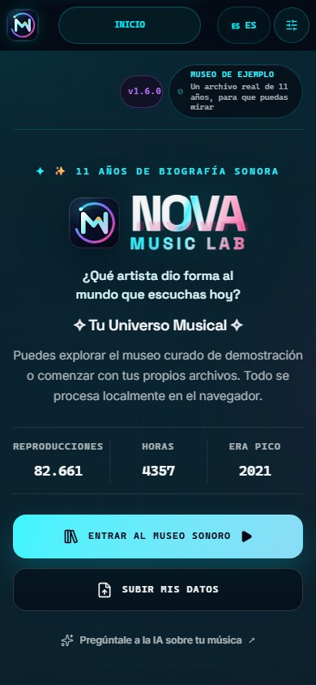
      <br><strong>A welcoming mobile entrance</strong> — Spanish copy and the responsive room navigation remain readable at 390 px.
    </td>
    <td width="50%" align="center">
      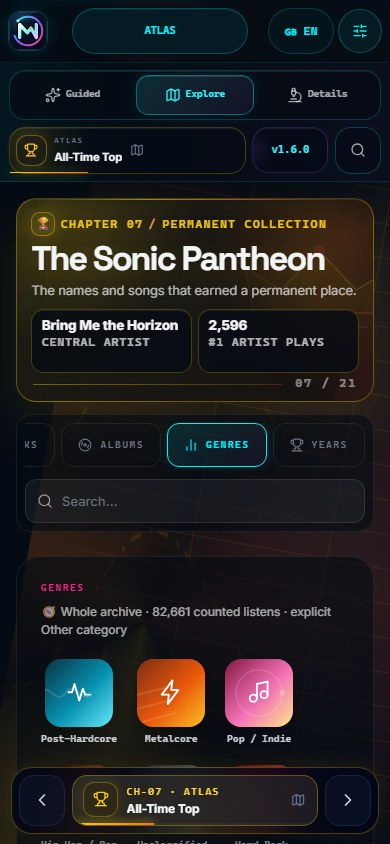
      <br><strong>Genres without clipping</strong> — the deep link, tabs and evidence chart fit the mobile viewport.
    </td>
  </tr>
</table>

<p align="center">
  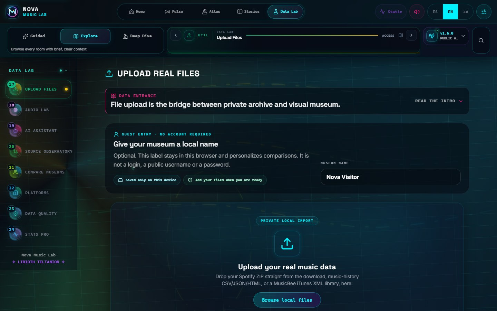
  <br><strong>A museum your friends can make their own</strong> — no account is required to name a local museum, import compatible files and begin a private comparison.
</p>

<p align="center">
  <picture>
    <source media="(prefers-reduced-motion: reduce)" srcset="./assets/releases/v1.6.0/product-tour-static-en-cyber.jpg">
    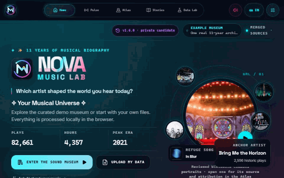
  </picture>
  <br><strong>Three rooms, one story</strong> — Home → Atlas → Genres shows how the invitation becomes evidence; reduced-motion readers receive a static frame.
</p>

<p align="center">
  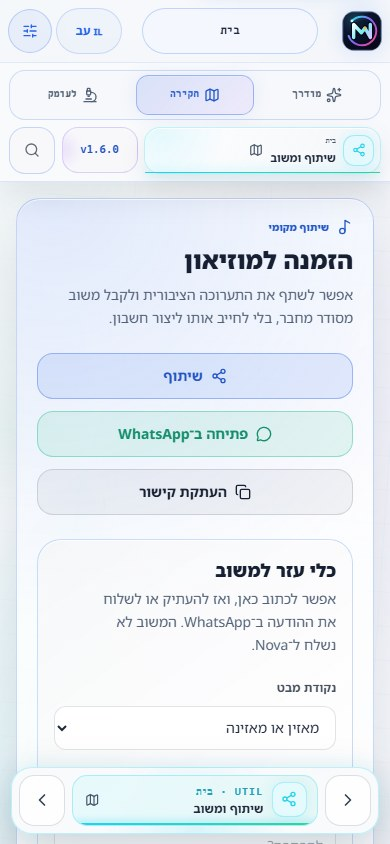
  <br><strong>One system across contexts</strong> — mobile, Hebrew RTL and a light theme use the same information architecture.
</p>

---

## 🌌 Why Nova Music Lab exists

Streaming platforms usually reduce years of listening to a short recap. Nova Music Lab treats an archive as a personal cultural artifact: something to investigate, revisit and interpret without surrendering the raw history to another analytics backend.

The project is built around four commitments:

1. **Evidence before spectacle.** Unknown information remains unknown; estimates and interpretations must be distinguishable from observed facts.
2. **Local-first ownership.** Visitor-selected archives are parsed and stored in the browser.
3. **Source awareness.** Each provider exposes different fields, so rooms only claim capabilities their active archive can support.
4. **A museum, not a spreadsheet.** Motion, sound-inspired art, narrative and exploration make the evidence emotionally legible.

---

## 🪞 Two museum modes

| Mode | Purpose | Data boundary |
|---|---|---|
| **Flagship Exhibition** | A curated demonstration of Kevin's personal music museum and Nova's full visual language. | A reviewed aggregate dataset is intentionally published with the static site and governed by [`public_dataset_manifest.json`](./src/data/public_dataset_manifest.json). |
| **My Museum** | A visitor imports supported exports and rebuilds the quantitative museum from the active archive. | Raw files stay in the browser; the app does not upload them to a Nova Music Lab server. |

`1.4.0` — deployed **2026-07-29** — makes **My Museum** a clear
Guest Museum journey. A visitor may add an optional browser-local display name,
but that label is not a login, password or public account. Compare Museums loads
the reviewed public artist catalog only when needed and labels older
top-list-only datasets as partial instead of overstating their overlap.

The evidence-first milestone, completed in `1.0.0` — published **2026-07-16** and now superseded — formalized this boundary everywhere: flagship-only stories must never masquerade as visitor-derived analysis, and every interpretive room must disclose its evidence level.

---

## 🛰️ Supported listening archives and library snapshots

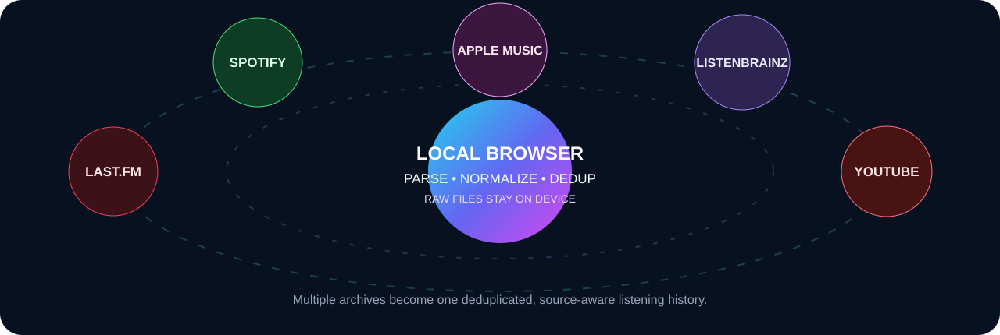

| Source | Supported export | Strongest evidence | Role |
|---|---|---|---|
| **Last.fm** | CSV export | Long chronology, scrobbles, sessions and streaks | Event timeline |
| **Spotify** | Extended Streaming History JSON | Duration, platforms, country, skips and short plays | Event timeline |
| **Apple Music** | `Play Activity.csv` | Apple listening activity and playback history | Event timeline |
| **ListenBrainz** | Listen JSON export | Open timestamped listening records | Event timeline |
| **YouTube / YouTube Music** | Google Takeout JSON or HTML history | Music video and YouTube Music activity | Event timeline |
| **MusicBee** | iTunes-compatible library XML | Local artists, albums, tracks, genres and saved counters | Separate library snapshot |
| **Combined museum** | Any supported combination | Source labels, normalization and evidence-aware overlap handling | Evidence-aware view |

Imports can be mixed. Source-specific fields remain source-specific: for example, Last.fm alone cannot prove Spotify device or skip behavior.

Repository operators can create a complete private Last.fm CSV with the
[local Last.fm export guide](./docs/product/LASTFM_LOCAL_EXPORT.md). The tool
prompts for the key locally and stores the raw result outside Git and OneDrive;
it is a manual snapshot, not a live connection and does not alter the public
flagship exhibition.

MusicBee is intentionally different: it shows what is in a local library, but
its cumulative play counts are not added to Spotify, Last.fm or the historical
timeline. Read the [MusicBee import guide](./docs/product/MUSICBEE_LIBRARY_SNAPSHOT.md)
for the simple export steps, retained fields and privacy boundary.

### Flagship snapshot freshness

The public exhibition is a **local historical snapshot**, not a live account
connection:

| Evidence date | Verified value |
|---|---|
| Observed listening period | 2015-03-01 through 2026-08-06 |
| Dataset generated | 2026-08-07 in Asia/Jerusalem (`2026-08-06T21:44:39.498Z`) |
| Artist enrichment generated | 2026-07-29 |
| Recent Pulse synchronized | 2026-07-02 |
| Automatic synchronization | No |

The app never labels this archive “updated 2026-08-09.” These dates describe
different evidence layers, not a live Spotify, Last.fm or MusicBee connection.
Any future refresh must be compiled privately, reconciled and pass the
public-bundle privacy audit before it can replace them.

---

## 🏛️ Museum hubs and experience depth

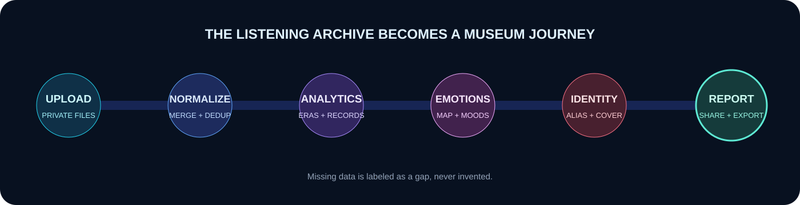

The museum is organized into five stable hubs:

- **Home** — orientation, archive overview, sharing and feedback.
- **Pulse** — recent movement, loops, achievements and yearly summaries.
- **Atlas** — Living Artist Atlas, rankings and cultural geography.
- **Stories** — eras, identity, emotion and the final narrative.
- **Data Lab** — import, local audio, comparisons, quality and advanced statistics.

Three persistent depths change how information is presented without hiding rooms or changing the URL:

- **Guided** — opens friendly introductions and gives a clear next step.
- **Explore** — the balanced default: a calm, visual, self-directed museum visit.
- **Deep Dive** — opens methodology and prioritizes evidence, limits and advanced controls.

The **Expedition Console** keeps depth and the active-archive capsule visible across desktop and mobile. `Ctrl/Cmd+K` opens Nova Command for keyboard-first access to the complete museum. Read the [experience contract](./docs/product/EXPERIENCE_MODEL.md).

Representative rooms include:

| Experience | What it explores |
|---|---|
| **Dashboard** | Archive identity, coverage and high-level signals |
| **Era Explorer** | How listening identity changes across years |
| **Top Histórico** | Artist, track and album dossiers with evidence-linked context |
| **Obsession Detector** | Repetition, streaks and concentrated listening periods |
| **Emotional Map** | Interpretive mood stations grounded in available signals |
| **Cultural Map** | Artist origins and listening geography |
| **Living Artist Atlas** | Searchable artist territories with archive weight, galleries, tracks, albums, offline profiles, provenance and opt-in official media |
| **Share & Feedback** | Browser sharing, WhatsApp invitation and structured local feedback without requiring an account |
| **Audio Lab** | Private local preview and file evidence boundary; advanced acoustic analysis is explicitly not run yet |
| **Source Observatory** | Last.fm, Spotify, YouTube, Apple Music and ListenBrainz coverage, field capabilities and honest missing-source states |
| **Data Quality Center** | Coverage, limitations and enrichment priorities |
| **Final Report** | A guided closing narrative and exportable summary |

Heavy rooms and data catalogs are lazy-loaded so the museum shell can appear before rarely visited analysis code is downloaded.

---

## 🔒 Privacy and network boundary


### What stays local

- Visitor-selected raw exports are parsed in the browser.
- A selected MusicBee XML is reduced to an allowlisted library snapshot; local file paths and persistent IDs are discarded.
- Imported museum state is stored in browser IndexedDB, not in a Nova backend database.
- Raw Spotify fields that are not required for analysis, such as IP addresses, are not retained.
- Clearing browser storage removes the local visitor museum from that browser profile.

### What is public

- The GitHub repository and Pages site contain a reviewed flagship aggregate dataset.
- Exact-granularity flagship sections require an explicit declaration in the public dataset manifest.
- CI audits the bundle for undeclared sections and raw identity/network fields.

### Optional and external requests

| Request | When it happens | What leaves the device |
|---|---|---|
| Google Fonts | Initial document load | Normal font request metadata |
| Remote artwork | A room displays curated external media | Image request metadata |
| YouTube/Spotify media | A visitor opens an embed or verified external link | The provider receives the request |
| Gemini | Only after a visitor explicitly configures a personal key and sends a question | The question and a bounded aggregate summary; never the raw export file |
| Share / WhatsApp | A visitor explicitly opens the share sheet or WhatsApp draft | The chosen app receives the prepared public link and text |

Nova Music Lab is therefore **local-first**, not network-isolated. A stricter no-remote-media Privacy Mode is tracked in the [roadmap](./ROADMAP.md).

Read the full [privacy threat model](./docs/architecture/PRIVACY_THREAT_MODEL.md) and [public data policy](./docs/data/PUBLIC_DATA_POLICY.md).

---

## 🧠 Evidence contract

Every analytical or narrative output should be classified as one of:

- **Observed** — directly supported by normalized archive events.
- **Derived** — deterministically calculated from observed data.
- **Inferred** — an interpretation with visible evidence and limitations.
- **Unavailable** — the active source cannot support the claim.

The project deliberately rejects plausible-looking fabricated numbers. Data reconciliation, source coverage, media identities and public-bundle privacy are enforced through scripts and tests.

## 🎨 Living Artist Atlas and Living Sonic Cartography

The generated artist manifest currently contains **100 artist records** and **295 provenance-aware visual assets**. Artist aliases, MusicBrainz/Wikidata identifiers, countries, genres, releases, members and official links remain separate from private play counts. Each image record carries its source, license-review state, attribution, focal point and cache/privacy policy; after the reviewed Wikimedia Commons metadata pass, **6 assets remain visibly queued for license review** rather than being mislabeled as reusable.

The Living Artist Atlas turns those records into explorable territories: progressive galleries with deterministic local fallbacks, archive-ranked tracks and albums, documented discography, official links and an on-demand evidence panel. Spotify and YouTube players stay behind an explicit privacy gate. Remote gallery images disclose their provider and network boundary instead of being described as local assets.

The `1.6.0` private candidate dated **2026-08-09** explains three different coverage
layers instead of collapsing them into one number. Analytical genre families
cover **94.2% of 82,661 plays**; detailed evidence exists for **457 of 6,593
catalog entries**; and **1,648 entries** remain unclassified. The evidence bundle
contains **1,290 assertions**: **85 accepted**, **1,203 candidate** and **2
rejected**. Accepted assertions appear as documented facts, candidates remain
visible suggestions, rejected relationships stay hidden and unresolved entries
say “To research.” `Observed` means an automatic classification derived from
listening evidence, while `Other` groups smaller known families. Emotional
readings remain a separate heuristic layer rather than masquerading as genres.

The 6,593-entry catalog is not a claim of 6,593 unique people or canonical artist
identities. The current reversible identity registry documents **182 known
normalized-name variant groups**; this candidate does not delete or merge the
historical rows.

External identity relationships and rejected matches are governed by [`artist_external_identity_policy.json`](./src/data/artist_external_identity_policy.json). The identity audit detects duplicate external IDs unless an exact transliteration or historical-rename relationship is declared; it also prevents known bad matches, including the rejected `nightlife` MusicBrainz identity, from returning silently.

The manifest installs into the local Dexie database only when its source fingerprint changes. Returning visitors download the small metadata fingerprint during idle bootstrap, not the complete artist catalog on every visit.

The interface uses a shared **Living Sonic Cartography** registry for room palettes, atmospheric geometry and semantic navigation icons. The Nova orbit/waveform mark now drives crisp favicon, PWA, maskable and monochrome icon variants as well as the repository's static social preview.

---

## 🧩 Architecture

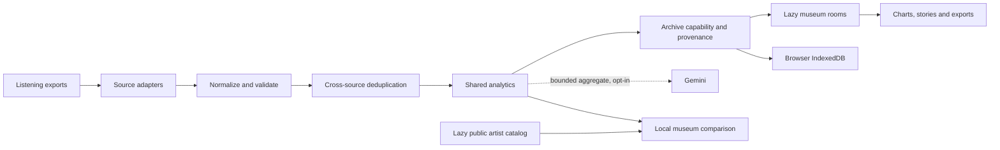
```mermaid
flowchart LR
    F["Listening exports"] --> P["Source adapters"]
    P --> N["Normalize and validate"]
    N --> D["Cross-source deduplication"]
    D --> A["Shared analytics"]
    A --> S["Archive capability and provenance"]
    S --> R["Lazy museum rooms"]
    R --> V["Charts, stories and exports"]
    S --> I["Browser IndexedDB"]
    A -. "bounded aggregate, opt-in" .-> G["Gemini"]
    A --> C["Local museum comparison"]
    K["Lazy public artist catalog"] --> C
```

| Layer | Primary responsibility |
|---|---|
| `src/utils/parser.ts` | Source parsing, normalization and merged dataset construction |
| `src/utils/musicBeeSnapshot.ts` | Privacy-safe MusicBee XML parsing into a separate local library snapshot |
| `src/utils/analytics.ts` | Shared quantitative calculations |
| `src/utils/datasetStorage.ts` | Local browser persistence and portable dataset validation |
| `src/db/` | Dexie/IndexedDB schema revision 4, typed storage outcomes, atomic museum activation and compatibility stores |
| `src/knowledge/` | Validated artist-knowledge manifest and provenance-rich visual records |
| `src/components/museumVisualIdentity.ts` | Shared room families, palettes, motion atmospheres and icon identity |
| `src/utils/identityEngine.ts` | Deterministic generative identity |
| `src/context/AppContext.tsx` | Language, theme and navigation state |
| `src/context/ExperienceContext.tsx` | Guided, Explore and Deep Dive preference with additive legacy migration |
| `src/components/shell/museumNavigation.ts` | Five-hub room ownership and canonical hub entry points |
| `src/App.tsx` | Museum shell, routing, transitions and data gate |
| `src/data/` | Curated public enrichment and the reviewed flagship bundle |

Database design, migrations and failure states are documented in [Storage and migrations](./docs/architecture/STORAGE_AND_MIGRATIONS.md).

---

## 🌍 Language, themes and accessibility

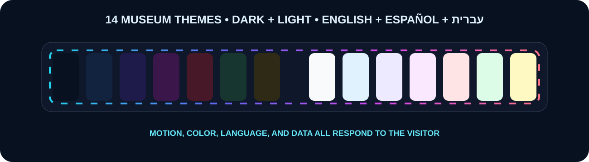

- English, Spanish and Hebrew interfaces.
- Correct Hebrew RTL document direction and `he-IL` formatting.
- Fourteen dark and light museum themes.
- Keyboard-aware navigation, focus restoration and mobile drawer behavior.
- Expressive, Calm and Static atmosphere modes; Calm is the default and the operating-system reduced-motion preference overrides animation.
- Reduced-motion behavior across application transitions, charts, canvas art and static repository artwork.
- Exact-value chart tables and CSV exports for non-visual access.

`1.2.0` — deployed **2026-07-29** — adds Playwright browser checks at 1440×900 and 390×844 plus automated axe WCAG A/AA checks. Automated scans catch only some issues, so keyboard, screen-reader semantics, contrast, RTL and visual review remain ongoing manual quality gates. See [Accessibility](./docs/design/ACCESSIBILITY.md).

---

## ✅ Quality gates

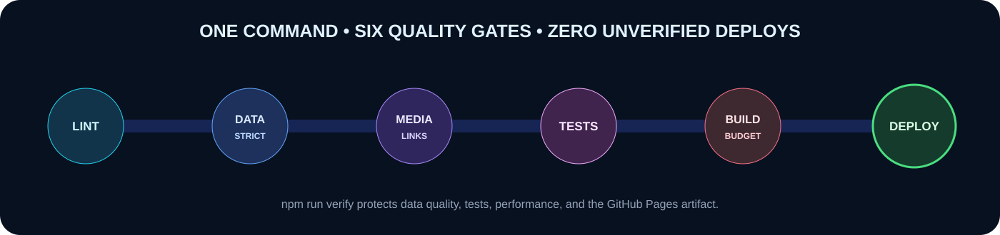

```bash
npm run verify
node scripts/audit_public_bundle_privacy.mjs
```

The verified Pages pipeline runs:

```text
lint
→ strict data audit
→ artist-identity relationship audit
→ strict media-link audit
→ artist-knowledge manifest audit
→ public-bundle privacy audit
→ PWA/installability contract audit
→ tests
→ TypeScript + production build
→ bundle budgets
→ Pages artifact
→ exact commit/version deployment smoke test
```

GitHub also runs CodeQL and dependency review. The Pages job can only deploy the artifact produced by the successful verification job.

---

## 💻 Local development

Requirements: Git and the Node version declared in `.nvmrc`.

```bash
git clone https://github.com/LiriothTeltanion/NovaMusicLab.git
cd NovaMusicLab
npm ci
npm run dev
```

Before opening a pull request:

```bash
npm run verify
node scripts/audit_public_bundle_privacy.mjs
git diff --check
git status
```

Useful commands:

| Command | Purpose |
|---|---|
| `npm run dev` | Start the local Vite server |
| `npm run build:check` | Build and enforce bundle budgets |
| `npm run verify` | Run the canonical code/data/test/build gate |
| `npm run audit:data` | Print current data coverage and priority queues |
| `npm run audit:identity` | Reject undeclared duplicate artist identities and known bad external matches |
| `npm run audit:links` | Validate curated media profiles and embeds |
| `npm run compile:data -- --source-dir <path> [--lastfm-file <csv>]` | Compile an explicitly selected local archive; ambiguous CSVs require an explicit path |
| `npm run preview` | Preview the production bundle locally |

The compiler never searches personal directories automatically. Use a review output and run the public-data audit before replacing any bundled flagship data.

### Optional build configuration

The creator CV call-to-action is **off by default** and is never bundled as a file. `CreatorCvLink` reads a public HTTPS URL from the environment, validates the protocol, and omits the link entirely when unset — so a fork never ships a broken or borrowed CV link.

| Variable | Effect |
|---|---|
| `VITE_CREATOR_CV_EN_URL` | Enables the CV link in English |
| `VITE_CREATOR_CV_ES_URL` | Enables the CV link in Spanish |
| `VITE_CREATOR_CV_HE_URL` | Enables the CV link in Hebrew (falls back to the English URL when unset, and the Hebrew label says so) |

Set them in `.env.local` for local runs, or as repository variables for the Pages build:

```bash
VITE_CREATOR_CV_EN_URL="https://example.com/cv-en.pdf"
```

Only `https:` URLs are accepted; anything else is ignored and the link stays hidden.

---

## 📚 Documentation

| Guide | Purpose |
|---|---|
| [Current status](./CURRENT_STATUS.md) | Verified public status, snapshot dates and release evidence |
| [Architecture overview](./docs/architecture/OVERVIEW.md) | System boundaries and data flow |
| [Guest Museum](./docs/product/GUEST_MUSEUM.md) | Account-free visitor import, comparison and optional future identity |
| [Storage and migrations](./docs/architecture/STORAGE_AND_MIGRATIONS.md) | IndexedDB, dataset envelopes and recovery |
| [Privacy threat model](./docs/architecture/PRIVACY_THREAT_MODEL.md) | Assets, imports, network and public-data risks |
| [Data sources](./docs/product/DATA_SOURCES.md) | Source capabilities and honest limitations |
| [Private Last.fm export](./docs/product/LASTFM_LOCAL_EXPORT.md) | Hidden-key local download, validation and private import workflow |
| [MusicBee library snapshot](./docs/product/MUSICBEE_LIBRARY_SNAPSHOT.md) | MusicBee XML export, retained fields, privacy and non-timeline limits |
| [Public data policy](./docs/data/PUBLIC_DATA_POLICY.md) | Rules for the published flagship bundle |
| [Artwork schema](./docs/data/ARTWORK_SCHEMA.md) | Artist, album, track and gallery asset contracts |
| [Visual system](./docs/design/VISUAL_SYSTEM.md) | Living Sonic Cartography, icons and motion tiers |
| [Quality gates](./docs/operations/QUALITY_GATES.md) | Local and CI verification |
| [Release guide](./docs/operations/RELEASE.md) | Versioning, tags, Pages and rollback process |
| [Contributing](./CONTRIBUTING.md) | Branch, commit, privacy and review expectations |
| [Security](./SECURITY.md) | Private vulnerability reporting |
| [Roadmap](./ROADMAP.md) | Ordered current and future product priorities |
| [Changelog](./CHANGELOG.md) | Durable release history |

---

## 🚀 Deployment and releases

The production museum is deployed through GitHub Pages from the verified `main` artifact:

**https://liriothteltanion.github.io/NovaMusicLab/**

`main` is intended to remain deployable. Product work should use focused branches and pull requests; the release process is documented in [`docs/operations/RELEASE.md`](./docs/operations/RELEASE.md).

`1.5.0` — deployed **2026-08-01** — is served by the protected GitHub Pages workflow. Pull request [#27](https://github.com/LiriothTeltanion/NovaMusicLab/pull/27) promoted the reviewed source, and workflow run [`30693829107`](https://github.com/LiriothTeltanion/NovaMusicLab/actions/runs/30693829107) verified, deployed and smoke-tested initial release commit `0e00227cb03d3bb2cbc1c3eead4ed3a5e6603b7d`. The [live build metadata](https://liriothteltanion.github.io/NovaMusicLab/build-meta.json) remains the authoritative artifact identity after documentation-only deployments. Product versions and IndexedDB schema versions remain deliberately independent.

`1.6.0` — **private candidate 2026-08-09** — exists only in the working source until its complete verification, visual-evidence and pull-request gates pass. The public URL, v1.5.0 tag and live build metadata remain authoritative; this README does not claim that the candidate is deployed.

---

## 👨‍💻 Creator

**Kevin Cusnir** — [LiriothTeltanion on GitHub](https://github.com/LiriothTeltanion)

Nova Music Lab combines frontend engineering, data visualization, music technology, privacy-conscious personal analytics, multilingual interaction, accessibility and generative art.

## 📄 License

The **software** is [MIT licensed](./LICENSE) — fork it, learn from it, build your own museum with it.

The **flagship dataset, generated visuals, narrative copy and brand** are reserved: that dataset is one person's listening history, published so the analysis is verifiable rather than as a dataset to redistribute. See [`DATA_LICENSE.md`](./DATA_LICENSE.md).

Album art, artist photographs and structured metadata are **linked, never redistributed**, and remain with their rightsholders; see [`THIRD_PARTY_NOTICES.md`](./THIRD_PARTY_NOTICES.md).

<div align="center">

### Your archive is not just a list of plays. It is a map of who you were, what you felt and how your sound evolved. ✨

</div>
