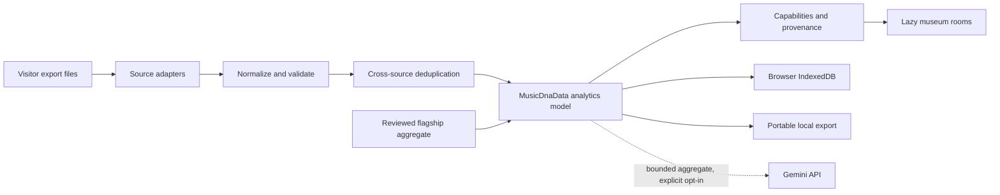

# Architecture Overview

Nova Music Lab is a static React application that turns supported listening exports into a browser-local museum. It has no server database for visitor archives. The public site includes a reviewed flagship aggregate dataset as a build artifact.

## System boundaries



## Runtime layers

### App shell

`src/App.tsx` owns the data gate, room registry, navigation shell, transitions and error boundaries. Routed rooms must remain lazy-loaded.

### Shared UI state

`src/context/AppContext.tsx` currently coordinates language, theme and navigation selection. v1 refactoring should divide unrelated state domains without changing user behavior.

### Source and analytics pipeline

`src/utils/parser.ts` accepts supported formats and builds a normalized `MusicDnaData` model. `src/utils/analytics.ts` provides shared calculations. The intended boundary is:

```text
source adapter → normalized event → validation → cross-source dedup → aggregation
```

Each stage should remain independently testable. Missing source capabilities must survive the pipeline as missing, not become fabricated defaults.

### Persistence

`src/utils/datasetStorage.ts` remains the compatibility path for the active aggregate and now exposes explicit save/load/clear outcomes. `src/db/` defines the wider Dexie **schema v4** model for evidence, imports, profiles, capabilities, insights and artist knowledge while retaining the legacy `datasets` store. Portable exports remain the recovery path. Schema v4 is a database version inside the `1.0.0-rc.1` product; it does not mean “Nova Music Lab v4.” See [Storage and migrations](./STORAGE_AND_MIGRATIONS.md).

### Curated public data

`src/data/` contains the flagship aggregate and curated artist/media knowledge used by the public build. `src/knowledge/` validates the deterministic manifest, while idle bootstrap installs it into IndexedDB only when the small metadata fingerprint changes. These files are public repository assets and follow the [Public data policy](../data/PUBLIC_DATA_POLICY.md).

### Presentation

Rooms combine React, Tailwind, Framer Motion, Recharts and custom canvas/SVG systems. `museumVisualIdentity.ts` is the shared Living Sonic Cartography registry for room families, palettes and atmospheric geometry. Expressive, Calm and Static modes share that identity; reduced-motion preference overrides animation. Shared chart, surface and typography primitives should continue replacing one-off room behavior.

## Dataset profiles

The application recognizes two product profiles:

- **Flagship Exhibition:** a reviewed public aggregate and curated Kevin-specific narrative layer.
- **My Museum:** a visitor-selected archive whose claims must derive from that active archive and its capabilities.

Components must not infer the profile from the presence of a particular artist or date. Profile identity, privacy tier and capabilities belong in explicit data metadata.

## Architectural invariants

- No raw visitor export is uploaded to a Nova Music Lab backend.
- No private credential is bundled in the frontend.
- No flagship-only narrative appears as visitor-derived evidence.
- Every routed room stays lazy-loaded.
- Heavy catalogs and the flagship dataset stay outside the entry bundle.
- Unknown data remains unavailable.
- Public data changes pass strict data, media and privacy audits.

## Decisions

- [ADR 0001 — Local-first architecture](./decisions/0001-local-first-architecture.md)
- [ADR 0002 — Public flagship and private visitor profiles](./decisions/0002-public-and-private-datasets.md)
- [ADR 0003 — Evidence-linked insights](./decisions/0003-evidence-linked-insights.md)
