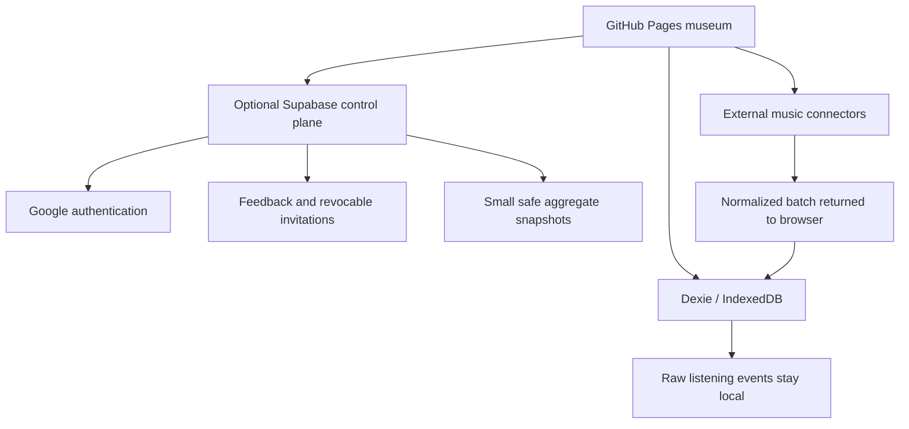

# Social, connector and Audio Lab architecture

Status: **foundation implemented locally — 2026-07-28; cloud control plane planned, not deployed**.

## Decision

Keep the public museum on GitHub Pages and keep raw listening history in browser IndexedDB. A future Supabase project may act as an **optional control plane** for authentication, safe share snapshots and feedback. The museum must continue to work when that backend is absent, paused or offline.

## Implemented foundation

### Share and feedback room

- Uses the browser share sheet when available.
- Falls back to copying the public museum URL.
- Opens a generic WhatsApp draft without a hard-coded recipient.
- Lets a listener, musician or creator compose structured feedback locally.
- Does not send or store feedback automatically.
- Points friends toward local import and two-museum comparison.

GitHub Pages serves one static Open Graph preview for all hash routes. Per-invitation or per-artist cards require pre-generated share pages or a dynamic service and are out of scope for this foundation.

### Audio Lab room

- Accepts recognized audio files up to 100 MB.
- Creates a temporary browser object URL and revokes it on clear/unmount.
- Shows only file metadata and duration reported by the browser.
- Does not upload or persist audio.
- Does not claim tempo, key, dynamics, genre or emotion analysis.
- Reserves explicit `Not run` evidence slots for a later versioned analysis worker.

## Planned optional control plane

Supabase is suitable for a personal beta because its free plan currently includes PostgreSQL, Auth, Row Level Security and Edge Functions. It is not a hard dependency: free projects can pause after low activity, so every cloud feature requires a local degraded state.

The browser must never receive service-role credentials, Spotify client secrets or a token-encryption key.

Candidate tables:

- `profiles`
- `museums`
- `provider_connections`
- `pulse_daily`
- `pulse_snapshots`
- `share_capsules`
- `share_feedback`
- `sync_receipts`

Candidate public contracts:

- `SafeMuseumSnapshotV1`: bounded period, counts, up to 20 artists/tracks and 12 genres, with provenance and redactions.
- `PulseSnapshotV1`: window, top/rising/new/returning entities, coverage and update time.
- `ShareInviteV1`: random token, expiry, permissions and safe snapshot reference.
- `FeedbackInputV1`: perspective, categories and plain text capped at 2,000 characters.
- `AudioAnalysisEvidenceV1`: algorithm, model/version, descriptors, limitations and provenance.

Row Level Security must deny by default. Raw listening events remain outside the cloud schema.

## Connector order

1. **ListenBrainz** — first live connector candidate because it has an open, documented listening API.
2. **Last.fm** — add only after API-key handling, caching, attribution and terms review are implemented.
3. **Spotify** — restricted beta, not public onboarding.

Spotify Development Mode is a Spotify API quota state, not a Nova interface mode. As documented in 2026, the app owner needs Premium and a development app supports up to five allow-listed authenticated users. It is appropriate for Kevin and a few testers, not for open public sign-in.

Connector tokens must use Authorization Code with PKCE where supported. With a GitHub Pages hash router, OAuth callbacks should return through query parameters at the application root; implicit-flow tokens must never be placed in the hash.

## Sources reviewed

- [Spotify quota modes](https://developer.spotify.com/documentation/web-api/concepts/quota-modes)
- [Spotify February 2026 Development Mode migration guide](https://developer.spotify.com/documentation/web-api/tutorials/february-2026-migration-guide)
- [Supabase billing and free-plan limits](https://supabase.com/docs/guides/platform/billing-on-supabase)
- [Supabase free-project pausing](https://supabase.com/docs/guides/platform/free-project-pausing)
- [ListenBrainz core API](https://listenbrainz.readthedocs.io/en/latest/users/api/core.html)
- [Last.fm API terms](https://www.last.fm/api/tos)
